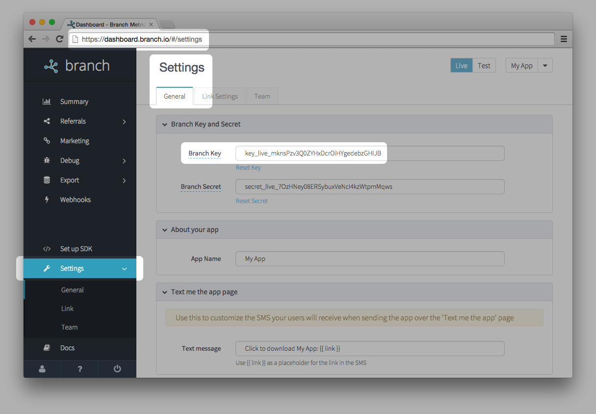

# Branch-Xamarin-SDK


## Introduction

The Xamarin SDK is a cross platform SDK you can use to access the Branch APIs from your Xamarin application.  The SDK is a PCL (Portable Class Library) that works with Xamarin Android, Xamarin iOS or Xamarin Forms applications.

## A Word About Async Methods

Most of the REST API calls in the SDK are submitted to a queue and executed in the background.  These requests, and their subsequent callbacks, occur on a background thread.  Due to the nature of how exceptions are handled by C# in background threads, exceptions that occur in a callback that are not caught, will be output to the console and consumed by the processing loop.

Be aware of this when executing UI functions in a callback.  Make sure that the UI functions are being executed inside a BeginInvokeOnMainThread call or it's platform equivalents.

## A Word About Building on Android

There's a problem with the Newtonsoft JSON package that we're using to do JSON processing. (It get’s pulled in as a dependency of the NuGet package.) In a release build, it has a linking problem which leads to an exception we are seeing under certain circumstances. This can be fixed by a change to the options for the Android app. It is only an Android problem.

Basically, right click on the project and select Options. Go to “Android Build” and select the “Linker” tab. Make sure the Release build configuration is selected. In the “Ignore assemblies” box, add “System.Core”. Rebuild the app. It should now run successfully.

## Installation

The Branch Xamarin SDK is now available as a [NuGet package](https://www.nuget.org/packages/Branch-Xamarin-Linking-SDK).  You will need to add the package to your Android, iOS and Forms (if applicable) projects.  

1. Right click on each project and select Add->Add NuGet Package or double click on the Packages folder to bring up the NuGet package dialog in Xamarin Studio.  
2. Find the _Branch Xamarin Linking SDK_ and select it.  This will add the required assemblies to your projects.  You need to do this for each project that will use Branch calls.  This include the Android and iOS projects even if this is a Forms based app since an initialization call needs to be added to each of the platform specific projects.  (See the next section.)

If you would rather build and reference the assemblies directly:

1. Clone this repository to your local machine  
2. Add the BranchXamarinSDK project to your solution and reference it from your Android, iOS and Forms (if applicable) project.  
3. Add the BranchXamarinSDK.Droid project to your solution and reference it from your Android project, if any.
4. Add the BranchXamarinSDK.iOS project and reference it from you iOS project, if any.

### Register your app

You can sign up for your own Branch Key at [https://dashboard.branch.io](https://dashboard.branch.io)

## Configuration (for tracking)

Ideally, you want to use our links any time you have an external link pointing to your app (share, invite, referral, etc) because:

1. Our dashboard can tell you where your installs are coming from
1. Our links are the highest possible converting channel to new downloads and users
1. You can pass that shared data across install to give new users a custom welcome or show them the content they expect to see

Our linking infrastructure will support anything you want to build. If it doesn't, we'll fix it so that it does: just reach out to alex@branch.io with requests.

## Initialize a session on Xamarin

Before starting, it's important to understand that we require a generic Xamarin initialization in addition to the Android and iOS initialization. To make matters worse, it's different depending on whether you're using Xamarin Forms or not. Please click one of the following to be linked to the appropriate init path to follow:

1. [Click here](https://github.com/BranchMetrics/Branch-Xamarin-SDK#xamarin-forms-setup) if you're using Xamarin Forms
2. [Click here](https://github.com/BranchMetrics/Branch-Xamarin-SDK#non-forms-xamarin-setup) if you're *not* using Xamarin Forms

### Xamarin Forms Setup

The SDK needs to be initialized at startup in each platform.  The code below shows how to do the platform specific initialization.  Note that this example shows a Xamarin Forms app.  The same Branch<platform>.Init calls need to be made whether Forms is used or not.


#### Android with Forms

For Android add the call to the onCreate of either your Application class or the first Activity you start. This just creates the singleton object on Android with the appropriate Branch key but does not make any server requests.  Note also the addition of OnNewIntent.  This is needed to get the latest link identifier when the app is opened from the background by following a deep link.

```csharp
public class MainActivity : global::Xamarin.Forms.Platform.Android.FormsApplicationActivity
{
	protected override void OnCreate (Bundle savedInstanceState)
	{
		base.OnCreate (savedInstanceState);

		global::Xamarin.Forms.Forms.Init (this, savedInstanceState);

		BranchAndroid.Init (this, "your branch key here", Intent.Data);

		LoadApplication (new App ());
	}
	
	// Ensure we get the updated link identifier when the app is opened from the
	// background with a new link.
	protected override void OnNewIntent(Intent intent) {
		BranchAndroid.GetInstance().SetNewUrl(intent.Data);
	}
}
```

#### iOS with Forms

For iOS add the code to your AppDelegate. This just creates the singleton object on Android with the appropriate Branch key but does not make any server requests.  Note also the addition of the OpenUrl method.  This is needed to get the latest link identifier when the app is opened from the background by following a deep link.

```csharp
[Register ("AppDelegate")]
public class AppDelegate : global::Xamarin.Forms.Platform.iOS.FormsApplicationDelegate
{
	public override bool FinishedLaunching (UIApplication uiApplication, NSDictionary launchOptions)
	{
		global::Xamarin.Forms.Forms.Init ();
		
		NSUrl url = null;
		if ((launchOptions != null) && launchOptions.ContainsKey(UIApplication.LaunchOptionsUrlKey)) {
			url = (NSUrl)launchOptions.ValueForKey (UIApplication.LaunchOptionsUrlKey);
		}

		BranchIOS.Init ("your branch key here", url);

		LoadApplication (new App ());
		return base.FinishedLaunching (uiApplication, launchOptions);
	}
	
	// Ensure we get the updated link identifier when the app is opened from the
	// background with a new link.
	public override bool OpenUrl(UIApplication application,
		NSUrl url,
		string sourceApplication,
		NSObject annotation)
	{
		Console.WriteLine ("New URL: " + url.ToString ());
		BranchIOS.getInstance ().SetNewUrl (url);
		return true;
	}
}
```

Note that in both cases the first argument is the Branch key found in your app from the Branch dashboard (see the screenshot below).  The second argument allows the Branch SDK to recognize if the application was launched from a content URI.

Here is the location of the Branch key



#### Generic init with Forms

The following code will make a request to the Branch servers to initialize a new session, and retrieve any referring link parameters if available. For example, If you created a custom link with your own custom dictionary data, you probably want to know when the user session init finishes, so you can check that data. Think of this callback as your "deep link router". If your app opens with some data, you want to route the user depending on the data you passed in. Otherwise, send them to a generic install flow.

This deep link routing callback is called 100% of the time on init, with your link params or an empty dictionary if none present.

```csharp
public class App : Application, IBranchSessionInterface
{
	protected override void OnResume ()
	{
		Branch branch = Branch.GetInstance ();
		branch.InitSessionAsync (this);
	}
	
	protected override async void OnSleep ()
	{
		Branch branch = Branch.GetInstance ();
		// Await here ensure the thread stays alive long enough to complete the close.
		await branch.CloseSessionAsync ();
	}
	
	#region IBranchSessionInterface implementation
	
	public void InitSessionComplete (Dictionary<string, object> data)
	{
		// Do something with the referring link data...
	}

	public void CloseSessionComplete ()
	{
		// Handle any additional cleanup after the session is closed
	}

	public void SessionRequestError (BranchError error)
	{
		// Handle the error case here
	}

	#endregion
}
```

#### Close session

Required: this call will clear the deep link parameters when the app is closed, so they can be refreshed after a new link is clicked or the app is reopened.

In a Forms App CloseSession is done in the OnSleep method of your App class. See the example above.

### Non-Forms Xamarin Setup

The following code will make a request to the Branch servers to initialize a new session, and retrieve any referring link parameters if available. For example, If you created a custom link with your own custom dictionary data, you probably want to know when the user session init finishes, so you can check that data. Think of this callback as your "deep link router". If your app opens with some data, you want to route the user depending on the data you passed in. Otherwise, send them to a generic install flow.

This deep link routing callback is called 100% of the time on init, with your link params or an empty dictionary if none present.

#### iOS without Forms

The iOS device specific code can register notification listeners to handle the init and close of sessions when the app is sent to the background or resumed.  The BranchIOS.Init call takes an optional third parameter that will enable this automatic close session behavior if the parameter is set to true.  If your iOS app is not a Forms app, use the following device specific init.

```csharp
[Register ("AppDelegate")]
public class AppDelegate : UIApplicationDelegate, IBranchSessionInterface
{
	public override bool FinishedLaunching (UIApplication uiApplication, NSDictionary launchOptions)
	{
		NSUrl url = null;
		if ((launchOptions != null) && launchOptions.ContainsKey(UIApplication.LaunchOptionsUrlKey)) {
			url = (NSUrl)launchOptions.ValueForKey (UIApplication.LaunchOptionsUrlKey);
		}

		BranchIOS.Init ("your branch key here", url, true);
		
		Branch branch = Branch.GetInstance ();
		branch.InitSessionAsync (this);

		// Do your remaining launch stuff here...
	}
	
	// Ensure we get the updated link identifier when the app is opened from the
	// background with a new link.
	public override bool OpenUrl(UIApplication application,
		NSUrl url,
		string sourceApplication,
		NSObject annotation)
	{
		BranchIOS.getInstance ().SetNewUrl (url);
		return true;
	}

	#region IBranchSessionInterface implementation
	
	public void InitSessionComplete (Dictionary<string, object> data)
	{
		// Do something with the referring link data...
	}

	public void CloseSessionComplete ()
	{
		// Handle any additional cleanup after the session is closed
	}

	public void SessionRequestError (BranchError error)
	{
		// Handle the error case here
	}

	#endregion
}
```

#### Android without Forms

For Android add the call to the onCreate of either your Application class or the first Activity you start. This just creates the singleton object on Android with the appropriate Branch key but does not make any server requests

```csharp
public class MainActivity : Activity, IBranchSessionInterface
{
	protected override void OnCreate (Bundle savedInstanceState)
	{
		base.OnCreate (savedInstanceState);

		global::Xamarin.Forms.Forms.Init (this, savedInstanceState);

		BranchAndroid.Init (this, "your branch key here", Intent.Data);

		Branch branch = Branch.GetInstance ();
		branch.InitSessionAsync (this);

		LoadApplication (new App ());
	}

	protected override void OnStop (Bundle savedInstanceState)
	{
		base.OnStop (savedInstanceState);

		Branch branch = Branch.GetInstance ();
		// Await here ensure the thread stays alive long enough to complete the close.
		await branch.CloseSessionAsync ();
	}
	
	// Ensure we get the updated link identifier when the app is opened from the
	// background with a new link.
	protected override void OnNewIntent(Intent intent) {
		BranchAndroid.GetInstance().SetNewUrl(intent.Data);
	}

	#region IBranchSessionInterface implementation
	
	public void InitSessionComplete (Dictionary<string, object> data)
	{
		// Do something with the referring link data...
	}

	public void CloseSessionComplete ()
	{
		// Handle any additional cleanup after the session is closed
	}

	public void SessionRequestError (BranchError error)
	{
		// Handle the error case here
	}

	#endregion
}
```

#### Close session

Required: this call will clear the deep link parameters when the app is closed, so they can be refreshed after a new link is clicked or the app is reopened.

For Android this should be done in OnStop. See the example above.

### Forms and non-Forms Functions

#### Retrieve session (install or open) parameters

These session parameters will be available at any point later on with this command. If no params, the dictionary will be empty. This refreshes with every new session (app installs AND app opens)

```csharp
Branch branch = Branch.GetInstance ();
Dictionary<string, object> sessionParams = branch.GetLatestReferringParams();
```

#### Retrieve install (install only) parameters

If you ever want to access the original session params (the parameters passed in for the first install event only), you can use this line. This is useful if you only want to reward users who newly installed the app from a referral link or something.

```csharp
Branch branch = Branch.GetInstance ();
Dictionary<string, object> installParams = branch.GetFirstReferringParams();
```

### Persistent identities

Often, you might have your own user IDs, or want referral and event data to persist across platforms or uninstall/reinstall. It's helpful if you know your users access your service from different devices. This where we introduce the concept of an 'identity'.

To identify a user, just call:

```csharp
Branch branch = Branch.GetInstance ();
branch.SetIdentityAsync("your user id", this);  // Where this implements IBranchIdentityInterface
```
